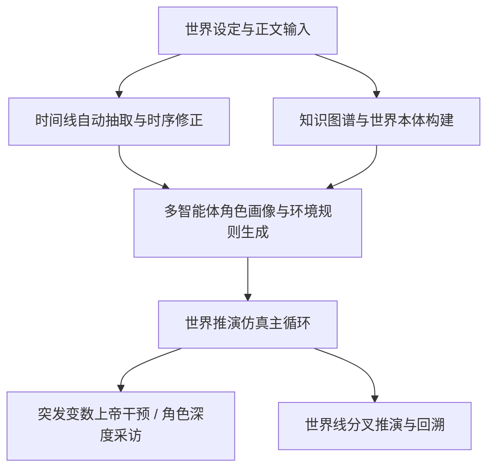

# 🐟 Miroworld 便携版 (Portable Edition)

> **万物可预测，世界可推演** —— 开箱即用、零配置依赖门槛、全自动国内网络加速的群体智能与小说世界推演引擎。

[](https://www.gnu.org/licenses/agpl-3.0)
[](https://python.org)
[](https://nodejs.org)
[]()

---

## 🌟 核心特性

- 🌍 **世界推演引擎优先**：集 **“设定库导入 ➔ 时序时间线抽取 ➔ 知识图谱构建 ➔ 多智能体动态仿真推演 ➔ 分叉世界线管理”** 于一体的通用推演系统。
- ⚡ **完全傻瓜式开箱即用**：零 Docker 依赖，双击脚本即可**全自动静默准备** Python、Node.js、Java、Neo4j 及双隔离虚拟环境，小白用户无需任何繁琐的前置环境安装。
- 🚀 **国内纯净网络全生态加速**：全面内置**清华源 (PyPI)**、**npmmirror (Node)**、**华为云/中科院软件所 (Neo4j)**、**GitHub Proxy** 镜像源与多节点自动容灾重试，国内环境秒级完成初始化。
- 🖥️ **Windows / macOS / Linux 深度兼容**：原生自适应各操作系统进程树管理、终端 UTF-8 编码重配与文件原子安全写入，彻底告别 Windows GBK 乱码与进程残留。
- 🤖 **全面赋能 AI Agent 与自动化**：提供强大的命令行工具集 `mirofish_cli.py` 与 OpenAPI 接口，全流程支持 `--json` 输出与流式推演日志。

---

## 🚀 极速启动（傻瓜式一键就绪）

脚本会自动检测系统环境；**若缺失 Python、Node、Java 或 Neo4j，将全自动后台下载配置**，无需手动前往官网下载安装包。

### 🍎 macOS / Linux 用户
```bash
# 1. 进入项目根目录
cd mirofish-portable

# 2. 赋予脚本执行权限并启动（直接双击或终端运行）
chmod +x scripts/*.sh
./scripts/start.sh
```

### 🪟 Windows 用户
```cmd
REM 进入项目目录，直接双击运行 start.bat 即可
cd mirofish-portable
scripts\start.bat
```

> 💡 **停止服务**：
> - macOS/Linux: 在启动终端按 `Ctrl+C` 或新开终端执行 `./scripts/stop.sh`（如需停数据库可加 `--all`）。
> - Windows: 运行 `scripts\stop.bat`（如需停数据库可加 `--all`）。

---

## 🌐 访问入口

启动成功后，即可在浏览器直接访问：

| 服务模块 | 访问地址 | 默认账号 / 说明 |
| :--- | :--- | :--- |
| 🎨 **Web 用户界面** | [http://localhost:3000](http://localhost:3000) | 交互推演、世界设定、时间线与图谱可视化 |
| ⚙️ **后端 RESTful API** | [http://localhost:5001](http://localhost:5001) | OpenAPI 接口与详细健康检查 (`/api/health`) |
| 🗄️ **Neo4j 图数据库** | [http://localhost:7474](http://localhost:7474) | 用户名 `neo4j` / 密码 `password` |
| 🧩 **模型设置中心** | 前端右下角「模型设置」 | 在线添加并测试 OpenAI / Claude / 深度求索 / 硅基流动 / 本地 Ollama 等模型 |

---

## 🧭 世界推演核心工作流



1. **设定库导入 (`World Bible`)**：输入世界背景、规则设定与小说正文，支持 txt/pdf/docx 拖拽上传与智能分块。
2. **时序时间线 (`Timeline`)**：自然篇章叙事流排序算法，精准提取全篇事件，杜绝颠倒倒流与阶段错位。
3. **世界图谱 (`Knowledge Graph`)**：动态生成实体本体（人物、组织、地理、概念、物品等）并建立语义图谱。
4. **多智能体仿真推演 (`Simulation`)**：自动为图谱实体注入行为动机与决策规则，执行各轮次移动、协同、警戒、救助与探索。
5. **分叉世界线 (`Worldline`)**：在任意历史事件节点进行推演分叉，探索“如果当时做出不同抉择”的全新世界走向。

---

## 🛠️ CLI 命令行操作（面向 AI Agent 与批处理）

项目提供统一 CLI 入口 `app/backend/scripts/mirofish_cli.py`：

```bash
# 使用后端 Python 虚拟环境
PYTHON="app/backend/.venv/bin/python"  # Windows 下为 app\backend\.venv\Scripts\python.exe
CLI="app/backend/scripts/mirofish_cli.py"

# 1. 查看项目列表
$PYTHON $CLI project list --json

# 2. 导入世界设定与正文
$PYTHON $CLI world save --project-id <PROJ_ID> --background "..." --story "..." --json

# 3. 抽取并排序时间线（阻塞等待并返回事件流）
$PYTHON $CLI timeline extract --project-id <PROJ_ID> --source story --wait --json

# 4. 构建世界知识图谱
$PYTHON $CLI graph build-world --project-id <PROJ_ID> --wait --json

# 5. 启动多轮世界推演（实时流式输出各角色行为决策）
$PYTHON $CLI sim start --project-id <PROJ_ID> --steps 6 --goal "推演主角决策发展" --wait --json
```

---

## 📂 项目结构全景

```
mirofish-portable/
├── app/
│   ├── backend/                 # Python Flask 后端系统
│   │   ├── app/
│   │   │   ├── api/             # RESTful 接口（world, timeline, graph, sim, assistant...）
│   │   │   ├── services/        # 核心服务层（时序归一化、推演引擎、图谱更新器）
│   │   │   ├── models/          # 任务管理与实体数据模型
│   │   │   └── utils/           # 原子写盘、跨平台 Logger、LLM 客户端
│   │   ├── scripts/             # 推演子进程与 CLI 脚本
│   │   ├── data/                # 本地持久化数据目录（世界设定、任务状态、推演事件）
│   │   └── requirements.txt     # 后端主环境依赖
│   └── frontend/                # Vue 3 + Vite 前端系统
│       ├── src/
│       │   ├── views/           # 推演看板、时间线、世界图谱可视化页面
│       │   └── components/      # 交互组件与节点图
│       └── package.json
├── neo4j/                       # 本地 Neo4j 便携数据库目录（随项目移动）
├── scripts/                     # 跨平台一键启动与维护脚本
│   ├── start.sh / start.bat     # macOS/Linux/Windows 傻瓜式一键启动入口
│   ├── stop.sh / stop.bat       # 跨平台安全停机与残留清理脚本
│   ├── setup-env.sh / .bat      # 依赖环境一键搭建
│   ├── install-neo4j.sh / .bat  # Neo4j 国内多源极速下载安装脚本
│   ├── init-models.sh / .bat    # 模型配置与注册表初始化
│   └── smoke.sh / smoke.bat     # 全流程端到端自动化冒烟测试
└── README.md                    # 本文档
```

---

## ❓ 常见问题排障 (FAQ)

### Q1: 运行脚本下载依赖非常慢或卡住？
> **A**: 系统已内置国内镜像加速：
> - Python 依赖默认走清华大学镜像站；
> - 前端依赖默认走 npmmirror 官方镜像；
> - Neo4j 自动在华为云、中科院软件所及官方镜像间容灾切换。
> 只要网络能够连通国内互联网，无需梯子即可秒级完成下载。

### Q2: 可以在移动硬盘或 U 盘中随身携带使用吗？
> **A**: **完全可以！** 
> 整个项目采用便携设计，数据库数据全部持久化在项目文件夹内（`neo4j/` 与 `app/backend/data/`）。拷入移动硬盘即可在任意电脑上即插即用。

### Q3: Windows 11 运行 `stop.bat` 提示找不到 wmic？
> **A**: 最新版本的 `stop.bat` 已原生支持 PowerShell `Get-CimInstance` 进程管理，无需依赖已被 Win11 弃用的 `wmic`，可完美停止并清理所有子进程。

### Q4: 如何运行自动化测试套件？
```bash
cd app/backend
.venv/bin/pytest tests/ -q  # 670+ 个单元测试用例 100% 绿色全通
```

---

## 📄 开源许可证

本项目遵循 [AGPL-3.0 License](LICENSE) 开源协议。
