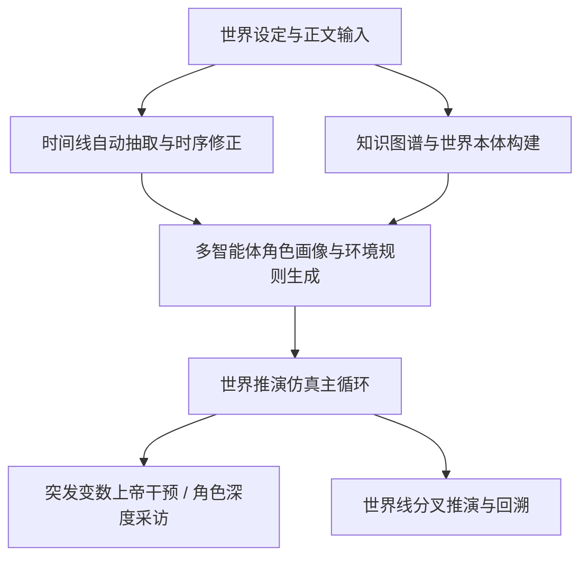

# 🐟 Miroworld 

> **万物可预测，世界可推演** —— 开箱即用、零配置依赖门槛、全自动国内网络加速的群体智能与小说世界推演引擎。

[](https://www.gnu.org/licenses/agpl-3.0)
[](https://python.org)
[](https://nodejs.org)
[]()


---

## 🌟 核心特性

- 🌍 **世界推演引擎优先**：集 **“设定库导入 ➔ 时序时间线抽取 ➔ 知识图谱构建 ➔ 多智能体动态仿真推演 ➔ 分叉世界线管理”** 于一体的通用推演系统。
- ⚡ **完全傻瓜式开箱即用**：零 Docker 依赖，双击脚本即可**全自动静默准备** Python、Node.js、Java、Neo4j 及双隔离虚拟环境，小白用户无需任何繁琐的前置环境安装。
- 🚀 **国内纯净网络全生态加速**：全面内置**清华源 (PyPI)**、**npmmirror (Node)**、**华为云/中科院软件所 (Neo4j)**、**GitHub Proxy** 镜像源与多节点自动容灾重试，国内环境秒级完成初始化。
- 🖥️ **Windows / macOS / Linux 深度兼容**：原生自适应各操作系统进程树管理、终端 UTF-8 编码重配与文件原子安全写入，彻底告别 Windows GBK 乱码与进程残留。
- 🤖 **全面赋能 AI Agent 与自动化**：提供强大的命令行工具集 `mirofish_cli.py` 与 OpenAPI 接口，全流程支持 `--json` 输出与流式推演日志。

---

## ⚡ 一行命令极速安装（单脚本傻瓜式拉取并自动配置）

无需提前克隆代码，打开终端/PowerShell 直接粘贴执行即可完成全套拉取与环境静默安装：

### 🍎 macOS / Linux 用户（一行命令）
```bash
# 官方通道
curl -fsSL https://raw.githubusercontent.com/qi-1021/miroworld/main/install.sh | bash

# 或者：国内网络高速镜像通道
curl -fsSL https://ghproxy.net/https://raw.githubusercontent.com/qi-1021/miroworld/main/install.sh | bash
```

### 🪟 Windows 用户（PowerShell 一行命令）
```powershell
# 官方通道
irm https://raw.githubusercontent.com/qi-1021/miroworld/main/install.ps1 | iex

# 或者：国内网络高速镜像通道
irm https://ghproxy.net/https://raw.githubusercontent.com/qi-1021/miroworld/main/install.ps1 | iex
```

---

## 🚀 启动与日常运行

安装完成后，直接进入目录即可一键启动（会自动检测并补齐 Python、Node、Java 与 Neo4j）：

### 🍎 macOS / Linux 启动
```bash
cd miroworld
./start.sh
```

### 🪟 Windows 启动
```cmd
cd miroworld
start.bat
```

> 💡 **日常管理与更新（根目录直接运行）**：
> - **一键无密更新**（自动免 Key 拉取 GitHub 最新代码并重新构建）：
>   - macOS/Linux: `./update.sh`
>   - Windows: 双击 `update.bat`
> - **停止服务**：
>   - macOS/Linux: 在终端按 `Ctrl+C` 或运行 `./stop.sh`（加 `--all` 停止 Neo4j）
>   - Windows: 双击 `stop.bat`（加 `--all` 停止 Neo4j）

---

## 🌐 访问入口

启动成功后，即可在浏览器直接访问：

| 服务模块 | 访问地址 | 默认账号 / 说明 |
| :--- | :--- | :--- |
| 🎨 **Web 用户界面** | [http://localhost:3000](http://localhost:3000) | 交互推演、世界设定、时间线与图谱可视化 |
| ⚙️ **后端 RESTful API** | [http://localhost:5001](http://localhost:5001) | OpenAPI 接口与详细健康检查 (`/api/health`) |
| 🗄️ **Neo4j 图数据库** | [http://localhost:7474](http://localhost:7474) | 用户名 `neo4j` / 密码 `password` |
| 🧩 **模型设置中心** | 前端右下角「模型设置」 | 在线添加并测试 OpenAI / Claude / 深度求索 / 硅基流动 / 本地 Ollama 等模型 |

---

## 🧠 模型配置推荐与最佳实践

Miroworld 采用分工协作架构，将模型分为 **主对话/决策 (Primary)**、**沙盘推演 (Simulation)**、**图谱抽取 (Graphiti LLM)** 与 **向量检索 (Embedding)** 4 类角色。

打开系统后点击右下角 **「模型设置」** 即可添加连接，推荐配置如下：

### 方案 A：🚀 高性价比与极速首选（国内直连推荐 · 深度求索 / 硅基流动）

| 角色分工 | 推荐模型 | 接口协议 | 推荐服务商 | 优势特点 |
| :--- | :--- | :--- | :--- | :--- |
| **主模型 / 决策** | `deepseek-chat` (V3) | OpenAI Compatible | DeepSeek 官方 / 硅基流动 | 逻辑严密、世界观把握精准、超高性价比 |
| **多智能体推演** | `deepseek-chat` / `Qwen/Qwen2.5-72B-Instruct` | OpenAI Compatible | 硅基流动 / 阿里云百炼 | 角色扮演鲜明、并发推理速度极快 |
| **图谱抽取构建** | `deepseek-chat` / `glm-4-flash` | OpenAI Compatible | 智谱 AI / 深度求索 | JSON 遵循能力强，实体与关系提炼精准 |
| **向量嵌入检索** | `BAAI/bge-m3` | OpenAI Compatible (Embeddings) | 硅基流动 / 本地 Ollama | 中文语义多语言召回最优、轻量无压力 |

> 💡 **硅基流动 (SiliconFlow) 快速配置模板**：
> - **API 基础端点**：`https://api.siliconflow.cn/v1`
> - **API Key**：填写您在硅基流动控制台生成的 `sk-...`
> - **推荐模型**：`deepseek-ai/DeepSeek-V3`、`Qwen/Qwen2.5-72B-Instruct`、`BAAI/bge-m3`

---

### 方案 B：👑 顶级推演与宏大叙事（国际旗舰推荐）

| 角色分工 | 推荐模型 | 接口协议 | 优势特点 |
| :--- | :--- | :--- | :--- |
| **主模型 / 决策** | `claude-3-5-sonnet-20241022` / `gpt-4o` | OpenAI / Anthropic 兼容 | 复杂因果推理与长篇小说剧情张力顶级 |
| **多智能体推演** | `claude-3-5-haiku-20241022` / `gpt-4o-mini` | OpenAI 兼容 | 兼顾极速响应与丰富的角色对话灵动性 |
| **图谱抽取构建** | `gpt-4o-mini` | OpenAI 兼容 | 严格遵循结构化 Schema，建图无死锁 |
| **向量嵌入检索** | `text-embedding-3-small` / `text-embedding-3-large` | OpenAI Embeddings | 国际公认高维度文本语义匹配标准 |

---

### 方案 C：🔒 100% 纯本地离线私有化（Ollama / vLLM）

适合追求**零成本、完全离线、绝不外传数据**的创作者：

1. 本地启动 [Ollama](https://ollama.ai) 并拉取模型：
   ```bash
   ollama run qwen2.5:14b
   ollama pull bge-m3
   ```
2. 在前端「模型设置」➔「添加连接」：
   - **连接名称**：`Ollama Local`
   - **端点 (Endpoint)**：`http://localhost:11434/v1`
   - **API Key**：任意填写或留空
   - **绑定模型**：LLM 设为 `qwen2.5:14b`，Embedding 设为 `bge-m3`

---

## 🧭 世界推演核心工作流



1. **设定库导入 (`World Bible`)**：输入世界背景、规则设定与小说正文，支持 txt/pdf/docx 拖拽上传与智能分块。
2. **时序时间线 (`Timeline`)**：自然篇章叙事流排序算法，精准提取全篇事件，杜绝颠倒倒流与阶段错位。
3. **世界图谱 (`Knowledge Graph`)**：动态生成实体本体（人物、组织、地理、概念、物品等）并建立语义图谱。
4. **多智能体仿真推演 (`Simulation`)**：自动为图谱实体注入行为动机与决策规则，执行各轮次移动、协同、警戒、救助与探索。
5. **分叉世界线 (`Worldline`)**：在任意历史事件节点进行推演分叉，探索“如果当时做出不同抉择”的全新世界走向。

---

## 🛠️ CLI 命令行操作（面向 AI Agent 与批处理）

项目提供统一 CLI 入口 `app/backend/scripts/mirofish_cli.py`：

```bash
# 使用后端 Python 虚拟环境
PYTHON="app/backend/.venv/bin/python"  # Windows 下为 app\backend\.venv\Scripts\python.exe
CLI="app/backend/scripts/mirofish_cli.py"

# 1. 查看项目列表
$PYTHON $CLI project list --json

# 2. 导入世界设定与正文
$PYTHON $CLI world save --project-id <PROJ_ID> --background "..." --story "..." --json

# 3. 抽取并排序时间线（阻塞等待并返回事件流）
$PYTHON $CLI timeline extract --project-id <PROJ_ID> --source story --wait --json

# 4. 构建世界知识图谱
$PYTHON $CLI graph build-world --project-id <PROJ_ID> --wait --json

# 5. 启动多轮世界推演（实时流式输出各角色行为决策）
$PYTHON $CLI sim start --project-id <PROJ_ID> --steps 6 --goal "推演主角决策发展" --wait --json
```

---

## 📂 项目结构全景

```
mirofish-portable/
├── app/
│   ├── backend/                 # Python Flask 后端系统
│   │   ├── app/
│   │   │   ├── api/             # RESTful 接口（world, timeline, graph, sim, assistant...）
│   │   │   ├── services/        # 核心服务层（时序归一化、推演引擎、图谱更新器）
│   │   │   ├── models/          # 任务管理与实体数据模型
│   │   │   └── utils/           # 原子写盘、跨平台 Logger、LLM 客户端
│   │   ├── scripts/             # 推演子进程与 CLI 脚本
│   │   ├── data/                # 本地持久化数据目录（世界设定、任务状态、推演事件）
│   │   └── requirements.txt     # 后端主环境依赖
│   └── frontend/                # Vue 3 + Vite 前端系统
│       ├── src/
│       │   ├── views/           # 推演看板、时间线、世界图谱可视化页面
│       │   └── components/      # 交互组件与节点图
│       └── package.json
├── neo4j/                       # 本地 Neo4j 便携数据库目录（随项目移动）
├── scripts/                     # 跨平台一键启动与维护脚本
│   ├── start.sh / start.bat     # macOS/Linux/Windows 傻瓜式一键启动入口
│   ├── stop.sh / stop.bat       # 跨平台安全停机与残留清理脚本
│   ├── setup-env.sh / .bat      # 依赖环境一键搭建
│   ├── install-neo4j.sh / .bat  # Neo4j 国内多源极速下载安装脚本
│   ├── init-models.sh / .bat    # 模型配置与注册表初始化
│   └── smoke.sh / smoke.bat     # 全流程端到端自动化冒烟测试
└── README.md                    # 本文档
```

---

## ❓ 常见问题排障 (FAQ)

### Q1: 运行脚本下载依赖非常慢或卡住？
> **A**: 系统已内置国内镜像加速：
> - Python 依赖默认走清华大学镜像站；
> - 前端依赖默认走 npmmirror 官方镜像；
> - Neo4j 自动在华为云、中科院软件所及官方镜像间容灾切换。
> 只要网络能够连通国内互联网，无需梯子即可秒级完成下载。

### Q2: 可以在移动硬盘或 U 盘中随身携带使用吗？
> **A**: **完全可以！** 
> 整个项目采用便携设计，数据库数据全部持久化在项目文件夹内（`neo4j/` 与 `app/backend/data/`）。拷入移动硬盘即可在任意电脑上即插即用。

### Q3: Windows 11 运行 `stop.bat` 提示找不到 wmic？
> **A**: 最新版本的 `stop.bat` 已原生支持 PowerShell `Get-CimInstance` 进程管理，无需依赖已被 Win11 弃用的 `wmic`，可完美停止并清理所有子进程。

### Q4: 如何运行自动化测试套件？
```bash
cd app/backend
.venv/bin/pytest tests/ -q  # 670+ 个单元测试用例 100% 绿色全通
```

## ✍️ 作者言

> 我从看到MiroFish这个项目那天起，就想将其改造为一个可以为小说创作者服务的工具了。
>
> 然而当时的人工智能能力还不是很高，可以完成改造需求的又都是Claude那种比较昂贵的模型。所以我只好放下幻想。
>
> 一切在Deepseek V4 Flash 0731发布之后改变了。这款模型非常的强大，已经足以帮助我完成整个项目了。因此这整个项目的重构，绝大多数都是由Deepseek帮我完成的。
>
> 然而，时运不济，命运多舛。DeepSeek在8月中旬的涨价让这一切被迫按下了暂停键。如果没有手头残存的一点Gemini额度做支撑，我实际上连发布都无法做到。
>
> 当然，这不代表我不再进行修改和维护，只是，现在肯定无法做一个修一个了。
>
> 不瞒各位，鄙人并非程序员，在计算机方面几乎目不识丁，只有想法，没有能力，所以，即使我迭代了很多次，依然有数不清的问题。
>
> 对此我只能像一个绿皮一样，俺寻思能用，但是实际上能不能用？我甚至无法第一时间在Windows机器上进行测试。
>
> 烦请诸君，不要对这个小玩具太过苛责，如果有问题，那就在issues上尽可能提出来。如果我看到且手上的AI还有余量的话，我当然会将问题汇总到一块，集中处理。如果各位自己着急，也可以与我联系，我们一起做。
>
> 最后我声明，我是个大技霸。
> 2026/08/17
> <div align="center">
  
</div>

---

## 🙏 鸣谢与致敬 (Acknowledgments)

本项目基于开源社区的智慧与心血演进而来，特别向以下优秀的开源项目与贡献者致以最崇高的谢意：

- **🌟 [MiroFish 原始官方项目](https://github.com/666ghg/MiroFish)**：感谢原作者及团队开创性的群体智能预测引擎设计，为世界推演与多智能体交互奠定了坚实而充满想象力的基石！
- **🛠️ [MiroFish-local](https://github.com/tt-a1i/MiroFish-local)**：感谢将 MiroFish 引入本地化部署的探索者与同志们，为零云端依赖的便携式运行提供了宝贵的实践基础。
- **🧬 [Graphiti / Zep](https://github.com/getzep/graphiti)** 与 **[Camel-AI / OASIS](https://github.com/camel-ai/oasis)**：感谢提供强大的知识图谱与多智能体仿真驱动支持。

---

## 📄 开源许可证

本项目遵循 [AGPL-3.0 License](LICENSE) 开源协议。

