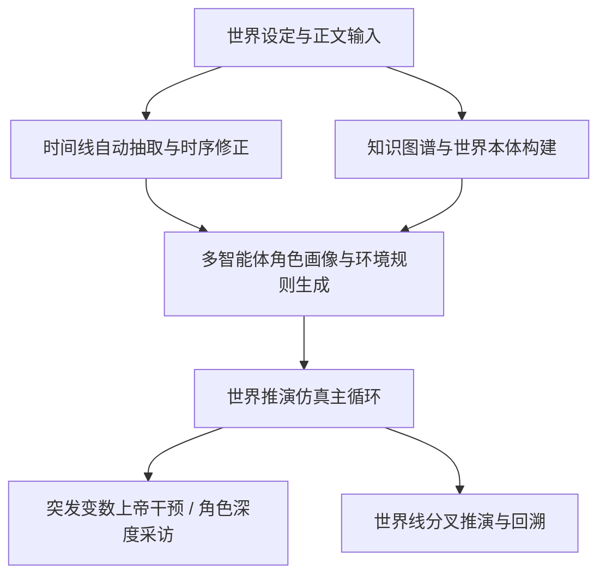

# 🐟 Miroworld 

> **万物可预测，世界可推演** —— 开箱即用、零配置依赖门槛、全自动国内网络加速的群体智能与小说世界推演引擎。

[](https://www.gnu.org/licenses/agpl-3.0)
[](https://python.org)
[](https://nodejs.org)
[]()

> 📖 **第一次用？** 直接看 **[完整使用教程 docs/TUTORIAL.md](docs/TUTORIAL.md)** —— 从零安装到手机远程、从排障到提 Issue，照着做就能通。

---

## 🌟 核心特性

- 🌍 **世界推演引擎优先**：集 **“设定库导入 ➔ 时序时间线抽取 ➔ 知识图谱构建 ➔ 多智能体动态仿真推演 ➔ 分叉世界线管理”** 于一体的通用推演系统。
- ⚡ **完全傻瓜式开箱即用**：零 Docker 依赖，双击脚本即可**全自动静默准备** Python、Node.js、Java、Neo4j 及双隔离虚拟环境，小白用户无需任何繁琐的前置环境安装。
- 🚀 **国内纯净网络全生态加速**：全面内置**清华源 (PyPI)**、**npmmirror (Node)**、**华为云/中科院软件所 (Neo4j)**、**GitHub Proxy** 镜像源与多节点自动容灾重试，国内环境秒级完成初始化。
- 🖥️ **Windows / macOS / Linux 深度兼容**：原生自适应各操作系统进程树管理、终端 UTF-8 编码重配与文件原子安全写入，彻底告别 Windows GBK 乱码与进程残留。
- 🤖 **全面赋能 AI Agent 与自动化**：提供强大的命令行工具集 `mirofish_cli.py` 与 OpenAPI 接口，全流程支持 `--json` 输出与流式推演日志。

---

## ⚡ 一行命令极速安装

无需提前克隆，打开终端/PowerShell 直接粘贴即可：

### 🍎 macOS / Linux
```bash
# 官方
curl -fsSL https://raw.githubusercontent.com/qi-1021/miroworld/main/install.sh | bash
# 国内镜像
curl -fsSL https://ghproxy.net/https://raw.githubusercontent.com/qi-1021/miroworld/main/install.sh | bash
```

### 🪟 Windows（PowerShell）
```powershell
irm https://raw.githubusercontent.com/qi-1021/miroworld/main/install.ps1 | iex
# 国内镜像
irm https://ghproxy.net/https://raw.githubusercontent.com/qi-1021/miroworld/main/install.ps1 | iex
```

---

## 🚀 启动与日常运行

```bash
cd miroworld
# macOS / Linux
./start.sh
# Windows
start.bat
```

> 日常：`./update.sh` / `update.bat` 一键更新；`./stop.sh --all` / `stop.bat --all` 停止（含 Neo4j）。详细步骤见 [TUTORIAL 第2章](docs/TUTORIAL.md#2-安装与启动从零到看到界面)。

---

## 🌐 访问入口

| 服务 | 地址 | 说明 |
| :--- | :--- | :--- |
| 🎨 **Web 界面** | [http://localhost:3000](http://localhost:3000) | 推演、设定、时间线与图谱 |
| ⚙️ **后端 API** | [http://localhost:5001](http://localhost:5001) | `/api/health` 健康检查 |
| 🗄️ **Neo4j** | [http://localhost:7474](http://localhost:7474) | `neo4j / password` |
| 🧩 **模型设置** | 前端右下角「模型设置」 | 详见下方与 [TUTORIAL 第3章](docs/TUTORIAL.md#3-模型配置3-分钟接好大脑) |

---

## 🧠 模型配置（极简版）

右下角 **「模型设置」** 添加 OpenAI 兼容连接即可。推荐：主模型 `Opencode go/mimo-v2.5` 或 `DeepSeek-v4-flash-0731`，向量 `硅基流动 BAAI/bge-m3`（免费）。接入方式可直接问任意 AI。**完整 3 分钟配置流程见 [TUTORIAL 第3章](docs/TUTORIAL.md#3-模型配置3-分钟接好大脑)。**

---

## 🧭 为什么要做这个东西、有什么用、技术上怎么做的

**为什么：** 小说/剧本/TRPG 的世界一旦写长，就会“吃设定”、时间线前后矛盾、人物动机漂移。现有工具要么只管写作排版，要么只做大纲，缺少一个能把“设定+正文”真正跑起来的推演沙盘。Miroworld 想补上这一块。

**有什么用：**
- **创作者**：一键查设定冲突、理清多线并行的时间线、试“如果主角当时选了另一条路”会怎样。
- **普通读者/测试者**：把任意长篇丢进去，看机器能否抽出靠谱的时间线与关系图谱，用来验证设定自洽性。
- **开发者/Agent**：所有能力都有 CLI 与 REST API，可被自动化脚本或 Agent 批量调用。

**技术上怎么做的（简述）：**
- **本地优先、便携运行**：Flask + Vue3 + Neo4j 全本地，不依赖云端；`app/backend/data/` 与 `neo4j/` 随项目目录走，拷硬盘即走。
- **设定库与检索**：`WorldBibleService` 对背景/正文分块 + 向量检索（BGE-M3 / 本地 embedding），支撑后续抽取与问答。
- **时序归一**：`timeline_normalizer` 把“三年后 / 幼年 / 星历2045年”等自然语言时间表达归一到可排序的 `sort_key`，再做多线程/多维度抽取。
- **知识图谱**：`Graphiti / Zep` 抽本体并写入 Neo4j，`graphiti_patch` 强制关闭思考模型、容错空响应与 JSON 围栏解析。
- **世界模拟**：独立子进程 `run_world_simulation` 以 `Semaphore(max_concurrency=2)` 限流并发 LLM 决策，避免 429；支持固定分钟/叙事跳跃、变数干预与世界线分叉。
- **模型分工**：`PRIMARY / SIMULATION / GRAPHITI_LLM / GRAPHITI_EMBEDDING` 四角色绑定，快照 + `GRAPHITI_MAX_CONCURRENCY=1` 串行保障稳定性；LLM 走 OpenCode 网关，SiliconFlow 仅作向量。
- **双端交付**：所有脚本成对提供 `.sh/.bat/.ps1`，`subst` 虚拟盘符解决 Windows 中文路径，5 源 PyPI 镜像轮询容灾，开箱即用是硬指标。

> 想看端到端操作、手机远程、排障与反馈，请直接进 **[TUTORIAL](docs/TUTORIAL.md)**；想看开发约束，请看 **[DEVELOPMENT](docs/DEVELOPMENT.md)**。

---

## 🧭 世界推演核心工作流



1. **设定库导入 (`World Bible`)**：拖拽 txt/pdf/docx，分块索引。
2. **时序时间线 (`Timeline`)**：多线抽取与排序，支持批量修正与分叉。
3. **世界图谱 (`Knowledge Graph`)**：本体生成与关系补边。
4. **仿真推演 (`Simulation`)**：多智能体按规则自主决策。
5. **分叉世界线 (`Worldline`)**：任意事件点开启平行推演。
> 10 分钟跑通示例见 [TUTORIAL 第4章](docs/TUTORIAL.md#4-第一次推演10-分钟端到端流程)。

---

## 🛠️ CLI（给 Agent 用，一句话）

`app/backend/scripts/mirofish_cli.py` 提供 `project/world/timeline/graph/sim/assistant` 全链路 CLI，全部支持 `--json` 与 `--wait` 流式。示例与参数详见 [TUTORIAL 第6章](docs/TUTORIAL.md#6-助手与-cli)。

---

## 📂 项目结构（简版）

```
miroworld/
├── app/backend/        # Flask 后端（api/services/models/utils）
├── app/frontend/       # Vue3 + Vite 前端
├── app/backend/data/   # 本地数据（world/timeline/sim/graph/task-manager）
├── neo4j/              # 便携 Neo4j
├── scripts/            # start/stop/smoke/setup-env/install-neo4j（成对 .sh/.bat）
└── docs/               # TUTORIAL / DEVELOPMENT / DEPLOYMENT 等
```
> 完整结构见 [docs/PROJECT-STRUCTURE.md](docs/PROJECT-STRUCTURE.md)。

---

## ❓ 常见问题（极简，更多见教程）

- **下载慢/卡住？** 已内置国内镜像，无需梯子；详见 [TUTORIAL 第8章](docs/TUTORIAL.md#8-如何发现错误日志在哪看什么)。
- **U 盘随身带？** 可以，`neo4j/` 与 `app/backend/data/` 随项目走。
- **端口占用？** `lsof -i :3000` / `netstat -ano | findstr :3000` 查 PID 后 `kill`。

---

## ✍️ 作者言

> 我从看到MiroFish这个项目那天起，就想将其改造为一个可以为小说创作者服务的工具了。
>
> 然而当时的人工智能能力还不是很高，可以完成改造需求的又都是Claude那种比较昂贵的模型。所以我只好放下幻想。
>
> 一切在Deepseek V4 Flash 0731发布之后改变了。这款模型非常的强大，已经足以帮助我完成整个项目了。因此这整个项目的重构，绝大多数都是由Deepseek帮我完成的。
>
> 然而，时运不济，命运多舛。DeepSeek在8月中旬的涨价让这一切被迫按下了暂停键。如果没有手头残存的一点Gemini额度做支撑，我实际上连发布都无法做到。
>
> 当然，这不代表我不再进行修改和维护，只是，现在肯定无法做一个修一个了。
>
> 不瞒各位，鄙人并非程序员，在计算机方面几乎目不识丁，只有想法，没有能力，所以，即使我迭代了很多次，依然有数不清的问题。
>
> 对此我只能像一个绿皮一样，俺寻思能用，但是实际上能不能用？我甚至无法第一时间在Windows机器上进行测试。
>
> 烦请诸君，不要对这个小玩具太过苛责，如果有问题，那就在issues上尽可能提出来。如果我看到且手上的AI还有余量的话，我当然会将问题汇总到一块，集中处理。如果各位自己着急，也可以与我联系，我们一起做。
>
> 最后我声明，我是个大技霸。
> 2026/08/17
> <div align="center">
  
</div>

---

## 🙏 鸣谢与致敬 (Acknowledgments)

本项目基于开源社区的智慧与心血演进而来，特别向以下优秀的开源项目与贡献者致以最崇高的谢意：

- **🌟 [MiroFish 原始官方项目](https://github.com/666ghg/MiroFish)**：感谢原作者及团队开创性的群体智能预测引擎设计，为世界推演与多智能体交互奠定了坚实而充满想象力的基石！
- **🛠️ [MiroFish-local](https://github.com/tt-a1i/MiroFish-local)**：感谢将 MiroFish 引入本地化部署的探索者与同志们，为零云端依赖的便携式运行提供了宝贵的实践基础。
- **🧬 [Graphiti / Zep](https://github.com/getzep/graphiti)** 与 **[Camel-AI / OASIS](https://github.com/camel-ai/oasis)**：感谢提供强大的知识图谱与多智能体仿真驱动支持。

---

## 📄 开源许可证

本项目遵循 [AGPL-3.0 License](LICENSE) 开源协议。
